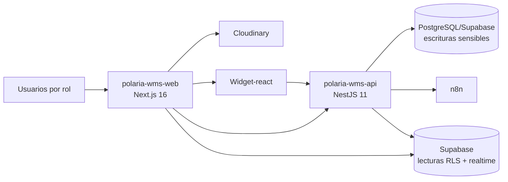

# POLARIA WMS — DOCUMENTACIÓN TÉCNICA Y OPERACIONAL (V1.0 VIVA)

> Documento vivo consolidado para el portal de flujos.  
> Actualizado con estado real de `polaria-wms-web`, `polaria-wms-api`, `polaria-wms-db` y `Widget-react` (Jul 2026).

## 0. VISIÓN DE NEGOCIO

Polaria WMS es una plataforma SaaS para operación logística de cadena fría.  
Su objetivo es orquestar, por tenant y bodega, los procesos de compra, recepción, almacenamiento, procesamiento, venta, despacho y soporte.

### Principios

- Multiempresa / multitenant.
- Control por roles y permisos.
- Inventario vivo por slot.
- Trazabilidad operativa y evidencia.
- Soporte técnico asistido (Mateo Widget).

## CHECKLIST MAESTRA

| Área | Estado | Observación |
| --- | --- | --- |
| Arquitectura documentada | ✅ | Alineada a repos reales (web/api/db/widget) |
| API referenciada | ✅ | Endpoint matrix actualizada en `/referencia/api/bodega-frio` |
| Testing documentado | ✅ | Matriz multi-repo en `/referencia/testing/bodega-frio` |
| Seguridad y RLS | ✅ | Estrategia híbrida descrita y riesgos listados |
| Runbooks | 🟡 | Parciales; falta DR/RPO-RTO y observabilidad formal |
| Manual de usuario por rol | ✅ | Nuevo documento para soporte |

## 1. README.md

Cada repositorio debe mantener un README orientado a su capa:

- `polaria-wms-web`: rutas, módulos por rol, variables y pruebas frontend.
- `polaria-wms-api`: módulos Nest, endpoints, guards, variables y pruebas backend.
- `polaria-wms-db`: migraciones, RLS, scripts de validación y seeds.
- `Widget-react`: embed, tokenización, historial y pruebas de widget.
- `flujos`: índice documental, referencias y navegación del Dev Hub.

## 2. Diagrama de arquitectura del sistema

Regla principal:

- lecturas operativas: cliente con RLS,
- escrituras críticas: backend con validación de tenant y permisos.

## 3. Documentación de API

Estado actual:

- Auth completo (incluye SSO/token Mateo),
- configuración empresa/cuenta/bodega,
- compras SOL/OC/recepción,
- inventario + locks + movimientos,
- operaciones (OT/tareas/alertas),
- procesamiento,
- ventas base,
- transporte base,
- conversaciones Mateo.

Consulta detallada:

- `/referencia/api/bodega-frio`

## 4. Variables de entorno y configuración

### Web (`polaria-wms-web`)

- `NEXT_PUBLIC_API_BASE_URL`
- `NEXT_PUBLIC_SUPABASE_URL`
- `NEXT_PUBLIC_SUPABASE_ANON_KEY`
- `NEXT_PUBLIC_MATEO_WIDGET_SCRIPT_URL` (opcional)

### API (`polaria-wms-api`)

- `DATABASE_URL`
- `SUPABASE_URL`
- `SUPABASE_ANON_KEY`
- `SUPABASE_SERVICE_ROLE_KEY`
- `MATEO_HANDOFF_SECRET`
- `MATEO_WIDGET_JWT_SECRET`
- `MATEO_ALLOWED_ORIGINS`

### DB (`polaria-wms-db`)

- variables de conexión Supabase/psql para aplicar y validar migraciones.

### Widget (`Widget-react`)

- `VITE_N8N_WEBHOOK_URL`
- `VITE_CLOUDINARY_CLOUD_NAME`
- `VITE_CLOUDINARY_UPLOAD_PRESET`

## 5. Guía de instalación y ejecución local

1. Clonar los repos:
   - `flujos`
   - `polaria-wms-web`
   - `polaria-wms-api`
   - `polaria-wms-db`
   - `Widget-react`
2. Instalar dependencias por repo.
3. Configurar variables de entorno por capa.
4. Aplicar migraciones/validaciones DB.
5. Levantar API y web.
6. Levantar `flujos` para navegación documental.

### Troubleshooting de instalación

- Si falla auth: validar variables Supabase y origen CORS API.
- Si falla mapa realtime: revisar publicación `warehouse_state` y suscripción web.
- Si fallan locks: validar permisos de rol + versión de fila.
- Si falla widget Mateo: revisar emisión de token (`/auth/mateo/widget-token`) y webhook n8n.

## 6. CONTRIBUTING.md

Buenas prácticas mínimas:

- cambios chicos y trazables por PR,
- actualizar documentación junto al cambio técnico,
- no mezclar migraciones y refactors no relacionados,
- incluir evidencia de pruebas (capturas/logs/comandos).

## 7. Glosario de términos del negocio

| Término | Definición |
| --- | --- |
| SOL | Solicitud de compra |
| OC | Orden de compra |
| OV | Orden de venta |
| OT | Orden de trabajo |
| TV | Viaje de transporte |
| FEFO | First Expired, First Out |
| Lock de slot | Bloqueo temporal de posición para evitar colisiones |
| Tenant | Unidad operativa de una empresa |

## 8. Flujos de negocio end-to-end

1. Configuración inicial plataforma (empresa/cuenta/bodega).
2. Alta de usuarios y catálogos por tenant.
3. SOL → OC → recepción.
4. Inventario en mapa (`warehouse_state`) y operaciones por OT.
5. Procesamiento y merma.
6. OV y despacho.
7. Transporte y evidencia.
8. Soporte con Mateo.

## 9. Architecture Decision Records (ADRs)

ADRs recomendados por mantener:

- separación lectura/escritura con RLS híbrido,
- estrategia de locks y concurrencia,
- criterios de ownership de conversaciones widget,
- convención de versionado de migraciones.

## 10. Documentación de testing

Matriz consolidada:

| Repo | Framework | Estado |
| --- | --- | --- |
| `polaria-wms-web` | Vitest + Testing Library | 465 tests detectados, 11 fallos abiertos |
| `polaria-wms-api` | Jest unit + e2e | Cobertura amplia, e2e mayormente con mocks |
| `polaria-wms-db` | SQL validation scripts | Validaciones RLS/tenant/mapa/widget |
| `Widget-react` | Vitest happy-dom | 62 tests |

Detalle vivo:

- `/referencia/testing/bodega-frio`

## 11. Runbooks de operación y deployment

Runbooks activos:

- despliegue por repo,
- ejecución de migraciones,
- validación de RLS,
- smoke funcional por rol,
- smoke del widget embebido.

Runbooks faltantes:

- respuesta a incidentes de concurrencia,
- DR (RPO/RTO),
- observabilidad y SLO de servicio.

## 12. Guía de onboarding para nuevos desarrolladores

Ruta sugerida:

1. leer este documento,
2. revisar `/documentacion/bodega-frio-documentacion-v20`,
3. recorrer `/paso-a-paso/bodega-frio`,
4. ejecutar pruebas base por repo,
5. tomar ticket corto de documentación o QA.

## 13. CHANGELOG.md

Todo cambio relevante debe registrarse por repositorio:

- cambio funcional,
- impacto por rol,
- pasos de validación,
- nota de retrocompatibilidad.

## 14. Documentación de seguridad y autenticación

Pilares:

- Supabase Auth,
- RLS por tenant/bodega,
- guards en API (`JwtAuthGuard`, `TenantGuard`, `RolesGuard`, `SensitiveWriteGuard`),
- separación de secretos por capa.

Riesgos conocidos:

- permisos lock de custodio (inconsistencia actual),
- falta de e2e con BD real en escenarios de concurrencia,
- necesidad de runbook formal de incidentes de seguridad.

## 15. Definición de entornos

| Entorno | Uso |
| --- | --- |
| local | desarrollo y pruebas manuales |
| staging | validación previa a release (objetivo) |
| producción | operación cliente |

## 16. Guía de observabilidad y monitoreo

Estado actual: parcial.  
Se recomienda centralizar:

- logs por módulo,
- métricas de latencia y error por endpoint,
- alertas de colas operativas y locks stale.

## 17. Política de versionado semántico (SemVer)

- `MAJOR`: cambios incompatibles de contratos o datos.
- `MINOR`: funcionalidades nuevas compatibles.
- `PATCH`: fixes sin romper contrato.

## 18. Notas de migración entre versiones mayores

Checklist de migración:

1. respaldo de DB,
2. migraciones en entorno previo,
3. smoke de rutas críticas por rol,
4. validación de RLS y tenants,
5. rollout controlado y monitoreo.

## 19. Storybook o catálogo de componentes UI

No centralizado aún.  
Objetivo: catálogo unificado para módulos compartidos y patrones por rol.

## 20. Compliance y normativas aplicables

Pendiente formalización legal/compliance por cliente:

- trazabilidad de cadena de frío,
- retención de evidencia y auditoría,
- controles de acceso por rol y tenant,
- respaldo y continuidad operacional.
